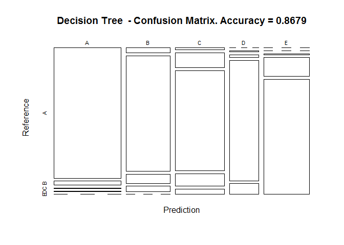

# Practical Machine Learning - Final Project
Rich Huebner  
August 5, 2016  


# Introduction

### Summary

Using devices such as Jawbone Up, Nike FuelBand, and Fitbit it is now possible to collect a large amount of data about personal activity relatively inexpensively. These type of devices are part of the quantified self movement - a group of enthusiasts who take measurements about themselves regularly to improve their health, to find patterns in their behavior, or because they are tech geeks. One thing that people regularly do is quantify how much of a particular activity they do, but they rarely quantify how well they do it. In this project, your goal will be to use data from accelerometers on the belt, forearm, arm, and dumbell of 6 participants. They were asked to perform barbell lifts correctly and incorrectly in 5 different ways. More information is available from the website here: [http://groupware.les.inf.puc-rio.br/har](http://groupware.les.inf.puc-rio.br/har) (see the section on the Weight Lifting Exercise Dataset).

### Data
The training data for this project are available here: https://d396qusza40orc.cloudfront.net/predmachlearn/pml-training.csv

The test data are available here: https://d396qusza40orc.cloudfront.net/predmachlearn/pml-testing.csv

The data for this project come from this source: http://groupware.les.inf.puc-rio.br/har. If you use the document you create for this class for any purpose please cite them as they have been very generous in allowing their data to be used for this kind of assignment.

### Goal

The overall goal of this analysis is to predict the manner in which the participants did the exercise. This is the ???classe??? variable in the training set. You may use any of the other variables to predict with. You should create a report describing how you built your model, how you used cross validation, what you think the expected out of sample error is, and why you made the choices you did. You will also use your prediction model to predict 20 different test cases.


# Data Acquisition

### Load the Required Libraries first.

```r
library(caret)
library(rpart)
library(rpart.plot)
library(RColorBrewer)
library(randomForest)
library(party)
library(partykit)
```


### Get the data.
In this section, I grab the data directly from the web. On first run, this may take some time. Be patient.


```r
set.seed(01886)

training_url <- "http://d396qusza40orc.cloudfront.net/predmachlearn/pml-training.csv"
testing_url <- "http://d396qusza40orc.cloudfront.net/predmachlearn/pml-testing.csv"
training <- read.csv(url(training_url), na.strings=c("NA","#DIV/0!",""))
testing <- read.csv(url(testing_url), na.strings=c("NA","#DIV/0!",""))

# Use a local copy so it's a bit faster. If you want to do a direct download, uncomment the above
# and re-comment the commands below.
setwd("D:\\Data\\RProjects\\PML")
#trainfile <- 'pml-training.csv'
#testfile <- 'pml-testing.csv'
#training <- read.csv(trainfile, header=TRUE, na.strings=c("NA","#DIV/0!",""))
#testing <- read.csv(testfile, header=TRUE, na.strings=c("NA", "#DIV/0!", ""))
```


# Data Cleansing / Tidying

### Data Partitioning

This step will partition the data set into a training set and a testing set, but only using the
initial training set provided in the instructions.  The original testing set is saved for testing
at the very end of the analysis -- basically to test out the model in the end.

Here, I partition by saving 75% of the original training data set as my training set, and the
remaining 25% as my testing data set. I will use this testing data set initially.


```r
Tr1 <- createDataPartition(training$classe, p=0.75, list=FALSE)
Train <- training[Tr1, ]
Test <- training[-Tr1, ]
dim(Train)
```

```
## [1] 14718   160
```

```r
dim(Test)
```

```
## [1] 4904  160
```

### Cleanse/Tidy

In this step, I clear out variables with near zero variances, remove the primary key or identifier column because it
will interfere with the analysis. Also, I cleanse variables that have anything more than 50% of "NA" values.

1. Handle variables/columns with NZVs.


```r
nzv <- nearZeroVar(Train, saveMetrics=TRUE)
Train <- Train[,nzv$nzv==FALSE]

nzv <- nearZeroVar(Test,saveMetrics=TRUE)
Test <- Test[,nzv$nzv==FALSE]
```

2. Handle the removal of the identifier column.

```r
Train <- Train[c(-1)]
```

3. Cleanse variables that have more than 60% "NA" values.

```r
clean_train <- Train
for(i in 1:length(Train)) {
    if( sum( is.na( Train[, i] ) ) /nrow(Train) >= .6) {
        for(j in 1:length(clean_train)) {
            if( length( grep(names(Train[i]), names(clean_train)[j]) ) == 1)  {
                clean_train <- clean_train[ , -j]
            }   
        } 
    }
}
# Set the cleansed data set back to the original variable, thus overwriting the original.
Train <- clean_train
```

Next, I transform the data on the myTesting and testing data sets.

```r
clean1 <- colnames(Train)

# remove the classe column
clean2 <- colnames(Train[, -58]) 

# only allow columns in Test that are also in Train
Test <- Test[clean1]         

# only allow testing that are also in Train
testing <- testing[clean2]             

dim(Test)
```

```
## [1] 4904   58
```

```r
dim(testing)
```

```
## [1] 20 57
```


```r
for (i in 1:length(testing) ) {
    for(j in 1:length(Train)) {
        if( length( grep(names(Train[i]), names(testing)[j]) ) == 1)  {
            class(testing[j]) <- class(Train[i])
        }      
    }      
}

# To get the same class between testing and Train
testing <- rbind(Train[2, -58] , testing)
testing <- testing[-1,]
```

# Prediction

In this section, I use the training and testing data sets to train and test my models. First, I employ a decision tree and then a random forest and compare the two results to see which is the better classifier/predictor.


### Decision Tree Approach

Here's a first stab at a decision tree.


```r
set.seed(01886)

# Create a decision tree first
dt1 <- rpart(classe ~ ., data=Train, method="class")
# Next, create predictions from the results of the decision tree model.
predict1 <- predict(dt1, Test, type = "class")

cm <- confusionMatrix(predict1, Test$classe)

cm$overall
```

```
##       Accuracy          Kappa  AccuracyLower  AccuracyUpper   AccuracyNull 
##      0.8678630      0.8327835      0.8580639      0.8772217      0.2844617 
## AccuracyPValue  McnemarPValue 
##      0.0000000            NaN
```

```r
plot(cm$table, col = cm$byClass, main = paste("Decision Tree  - Confusion Matrix. Accuracy =", round(cm$overall['Accuracy'], 4)))
```

<!-- -->

The results from the decision tree show a predictive accuracy of 86.79%, which is pretty good all things considered. Next, let's examine another approach to see if we can do better.

### Random Forest Approach

Let's build a forest. We do this by first creating a randomForest where we're trying to predict the "classe" variable from the Training (Train) set. Next, the rf_pred object holds a prediction and its results using the rf1 model we created in the first step. After I apply the predict function and store the result in rfpred, I create a confusion matrix and display the results of that. The confusion matrix shows the predictive accuracy of the randomForest.


```r
set.seed(01886)
rf1 <- randomForest(classe ~ ., data = Train)
rf_pred <- predict(rf1, Test, type = "class")
confmat <- confusionMatrix(rf_pred, Test$classe)

# And display the confusion matrix with the results/statistics. I'm especially
# interested in the accuracy of the model and its ability to predict.
confmat
```

```
## Confusion Matrix and Statistics
## 
##           Reference
## Prediction    A    B    C    D    E
##          A 1395    0    0    0    0
##          B    0  949    2    0    0
##          C    0    0  853    8    0
##          D    0    0    0  796    0
##          E    0    0    0    0  901
## 
## Overall Statistics
##                                          
##                Accuracy : 0.998          
##                  95% CI : (0.9963, 0.999)
##     No Information Rate : 0.2845         
##     P-Value [Acc > NIR] : < 2.2e-16      
##                                          
##                   Kappa : 0.9974         
##  Mcnemar's Test P-Value : NA             
## 
## Statistics by Class:
## 
##                      Class: A Class: B Class: C Class: D Class: E
## Sensitivity            1.0000   1.0000   0.9977   0.9900   1.0000
## Specificity            1.0000   0.9995   0.9980   1.0000   1.0000
## Pos Pred Value         1.0000   0.9979   0.9907   1.0000   1.0000
## Neg Pred Value         1.0000   1.0000   0.9995   0.9981   1.0000
## Prevalence             0.2845   0.1935   0.1743   0.1639   0.1837
## Detection Rate         0.2845   0.1935   0.1739   0.1623   0.1837
## Detection Prevalence   0.2845   0.1939   0.1756   0.1623   0.1837
## Balanced Accuracy      1.0000   0.9997   0.9978   0.9950   1.0000
```


Using the random forest approach resulted in a 99.8% accuracy. This is a significant improvement over the decision tree approach. 


# Summary of Results


```r
# Compute the out-of-sample error. This is computed by substracting the predictive accuracy from 1.

oos <- (1 - round(confmat$overall['Accuracy'], 4))*100
```

By using the decision tree algorithm, the predictive accuracy is 86.79%.  Then, by using the random forest approach, the predictive accuracy is 99.8%. It is clear that the randomForest performs better for predictive accuracy.  There is an out-of-sample error of: 0.2%.  


### Apply RandomForest algorithm to the test data.

Let's use the randomForest technique on the final testing set to see what we come up with. We'll use the "rf1" or random forest 1 model that I built.


```r
# Compute the final prediction using the test data.

final_p <- predict(rf1, testing, type = "class")
final_p
```

```
##  2 31  4  5  6  7  8  9 10 11 12 13 14 15 16 17 18 19 20 21 
##  B  A  B  A  A  E  D  B  A  A  B  C  B  A  E  E  A  B  B  B 
## Levels: A B C D E
```


# Conclusions

In this analysis, decision trees and randomforests were used to predict the manner in which the participants did an exercise. I found that the randomForest approach had much higher predictive accuracy than the decision tree classifier. The confusion matrices show the predictive accuracy and confidence intervals. Additionally, the p-value for the classifiers were both < .05 indicating these models were statistically significant.


This concludes the analysis.

~Rich Huebner


